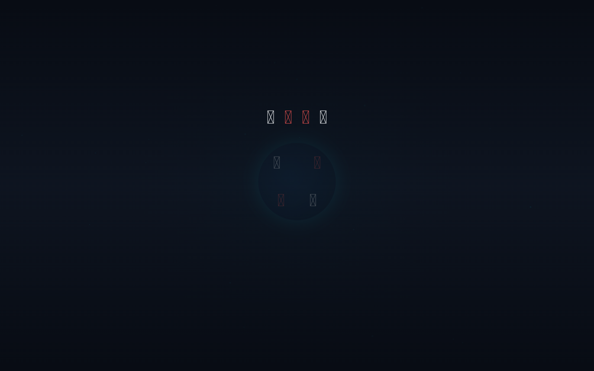

# Game29 - 29 Cards Game

A classic 29-card game built with Flutter and deployed as a web application.

## 🎮 Play the Game

Visit the live website: [https://innnervision.github.io/Game29/](https://innnervision.github.io/Game29/)

## 📸 Screenshots

### Splash Screen

### Home Screen

### Game Screen

### Settings

### History

### Leaderboard

## 🚀 Features

- Classic 29-card game mechanics
- Multiplayer support
- Leaderboard system
- Game history tracking
- Responsive design

## 🛠️ Tech Stack

- Flutter
- Dart
- Firebase (for backend services)

## 📝 License

This project is open source and available under the MIT License.
